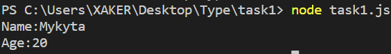
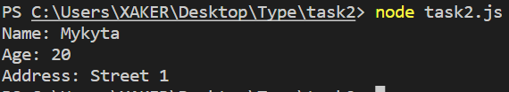
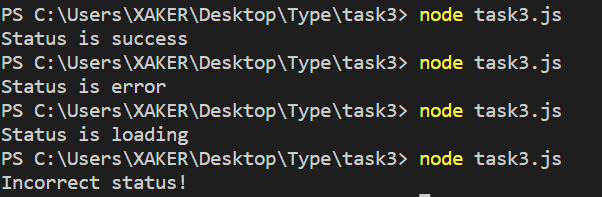
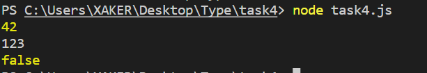
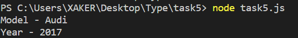

1. Типізація змінних
Оголосіть змінні наступних типів: string, number, boolean, array, object.
Створіть функцію, яка приймає як аргумент об'єкт із полями name (тип string) та age (тип number) і повертає рядок виду: "Name: John, Age: 30".
Результат буде такий :

  

Тут було оголошено змінні str,num,bool,arr,obj з відповідними типами даних. Також було
реалізовано функцію userFunction, яка виводить рядок з даними об'єкту.
2. Інтерфейси
Оголосіть інтерфейс Person, який містить поля:
name: string
age: number
address?: string (опціональне поле)
Реалізуйте функцію printPerson, яка приймає об'єкт типу Person та виводить його дані у консоль.
В цьому завданні було реалізовано інтерфейс з опціональним полем address та створено функцію, яка виводить дані цього об'єкту

  

3. Композитні типи
Оголосіть об'єднаний тип (union type), наприклад: 

type Status = 'success' | 'error' | 'loading';

Реалізуйте конструкцію (наприклад, функцію або умову), яка виводить повідомлення відповідно до значення Status.

  

4. Дженерики
Реалізуйте функцію identity<T>(value: T): T, яка повертає передане їй значення.
Використайте її для типів number, string та boolean.
Мною було реалізовано функцію identity<T>, яка приймає значення будь-яких типів та повертає це значення. Я передав у цю функцію значеня типу
number, boolean, string

  

5. Класи
Реалізуйте клас Car, який містить поля:
model: string
year: number
Додайте метод getCarInfo(), який повертає рядок виду: "Model: Toyota, Year: 2020".
В цьому завданні було створено клас Car з полями model та year, створено конструктор та метод для виводу інформації

  

